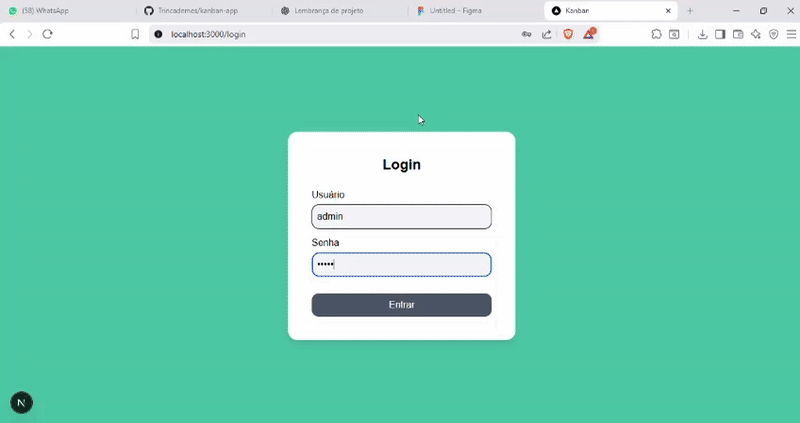

# Projeto Final Front-End (Kanban Node.js)

## Pedro Vieira Cavalciuk TADS

## Visão Geral

Este projeto é um sistema Kanban, criado com Next.js, React e
Tailwind. Permitindo criação, organização
e movimentação de tarefas entre colunas.

## Funcionalidades

-   Login e logout via Firebase Authentication\
-   Modal para adicionar tarefas\
-   Drag & Drop entre colunas\
-   Interface moderna, responsiva e estilizada

## Tecnologias Usadas

-   Next.js 14\
-   React\
-   TailwindCSS\
-   Firebase Auth\
-   Firestore\
-   React Beautiful DnD\
-   Context API

## Instalação

``` bash
git clone https://github.com/Trincademes/kanban-app.git
npm install
```


## Executar

``` bash
npm run dev
```

Abra:\
http://localhost:3000

## Prévia do Projeto


